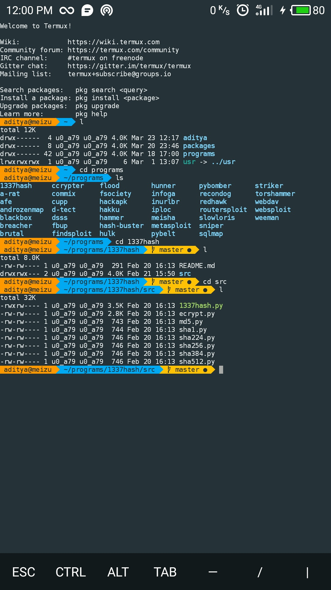
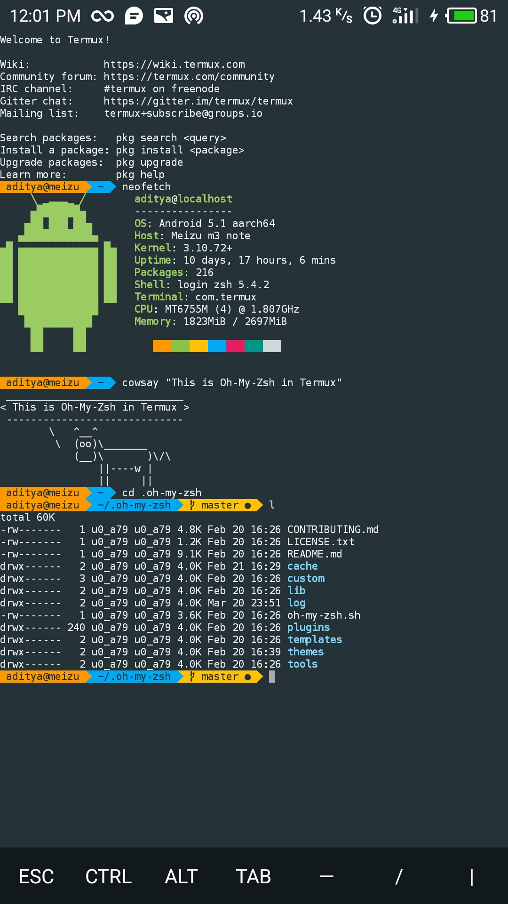

# Termux OMZ

Simple script to install **[oh-my-zsh](https://ohmyz.sh)** in **[Termux](https://termux.com)**.

This setup will apply -
- Material color-scheme
- Dejavu font with powerline support
- Agnoster zsh-theme as default

### How to install

```bash
# First, clone this repository by typing...
git clone https://github.com/adi1090x/termux-omz.git

# Change to termux-omz directory
cd termux-omz

# Make script executable
chmod +x install

# Run install script
./install

# And Done, oh-my-zsh is successfully installed on your termux.
```

### Previews

|Screenshot 1|Screenshot 2|
|--|--|
|||
